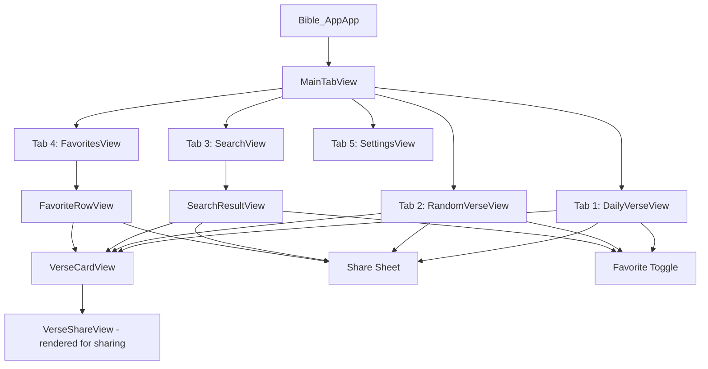

# AGENTS

## Bible Verse App — Architecture Document

### Overview

A SwiftUI Bible verse app for iOS 17+ that fetches verses from **bible-api.com**, presents them with beautiful typography, and allows users to save favorites, discover random verses, and share them as styled cards. Built with MVVM, Swift Concurrency, and SwiftData persistence.

---

## 1. File & Folder Structure

```
Bible App/
├── Bible_AppApp.swift                  # App entry point, SwiftData container setup
│
├── Models/
│   ├── BibleResponse.swift             # API response model (Codable)
│   ├── Verse.swift                     # Individual verse model (Codable)
│   └── FavoriteVerse.swift             # SwiftData @Model for local persistence
│
├── Services/
│   ├── BibleAPIClient.swift            # Network layer — async/await API calls
│   └── DailyVerseService.swift         # Logic for daily verse selection & caching
│
├── ViewModels/
│   ├── DailyVerseViewModel.swift       # Drives the home/daily verse screen
│   ├── RandomVerseViewModel.swift      # Drives the random verse screen
│   ├── SearchViewModel.swift           # Drives the search screen
│   ├── FavoritesViewModel.swift        # Drives the favorites list
│   └── SettingsViewModel.swift         # Drives settings/preferences
│
├── Views/
│   ├── MainTabView.swift               # Root TabView with all tabs
│   ├── DailyVerse/
│   │   └── DailyVerseView.swift        # Home screen — verse of the day
│   ├── RandomVerse/
│   │   └── RandomVerseView.swift       # Random verse with shuffle animation
│   ├── Search/
│   │   ├── SearchView.swift            # Search input + results
│   │   └── SearchResultView.swift      # Single search result row
│   ├── Favorites/
│   │   ├── FavoritesView.swift         # List of saved favorites
│   │   └── FavoriteRowView.swift       # Single favorite row
│   ├── Settings/
│   │   └── SettingsView.swift          # Settings screen
│   └── Shared/
│       ├── VerseCardView.swift         # Reusable large verse card component
│       ├── VerseShareView.swift        # Rendered card for share sheet
│       ├── LoadingView.swift           # Animated loading indicator
│       └── ErrorView.swift             # Reusable error state with retry
│
├── Theme/
│   ├── AppTheme.swift                  # Colors, fonts, spacing constants
│   └── Color+Extensions.swift          # Custom Color definitions
│
├── Extensions/
│   ├── String+Trimming.swift           # Whitespace/newline cleanup for verse text
│   └── View+ShareSheet.swift           # UIActivityViewController bridge
│
├── Assets.xcassets/
│   ├── AccentColor.colorset/           # Accent color (warm gold)
│   ├── AppIcon.appiconset/             # App icon
│   ├── Colors/                         # Named color sets
│   │   ├── CardBackground.colorset/
│   │   ├── PrimaryText.colorset/
│   │   ├── SecondaryText.colorset/
│   │   └── AccentGold.colorset/
│   └── Contents.json
│
└── Preview Content/
    └── PreviewData.swift               # Mock data for SwiftUI previews
```

---

## 2. Data Models

### 2.1 API Response Models

```
┌─────────────────────────────────────────────┐
│ BibleResponse                    (Codable)  │
├─────────────────────────────────────────────┤
│ + reference: String                         │
│ + verses: [VerseEntry]                      │
│ + text: String                              │
│ + translationId: String                     │
│ + translationName: String                   │
│ + translationNote: String                   │
└─────────────────────────────────────────────┘
          │
          │ contains
          ▼
┌─────────────────────────────────────────────┐
│ VerseEntry                       (Codable)  │
├─────────────────────────────────────────────┤
│ + bookId: String                            │
│ + bookName: String                          │
│ + chapter: Int                              │
│ + verse: Int                                │
│ + text: String                              │
└─────────────────────────────────────────────┘
```

**Coding Keys Mapping:**

| JSON Key           | Swift Property    |
| ------------------ | ----------------- |
| `reference`        | `reference`       |
| `verses`           | `verses`          |
| `text`             | `text`            |
| `translation_id`   | `translationId`   |
| `translation_name` | `translationName` |
| `translation_note` | `translationNote` |
| `book_id`          | `bookId`          |
| `book_name`        | `bookName`        |
| `chapter`          | `chapter`         |
| `verse`            | `verse`           |

### 2.2 Persistence Model (SwiftData)

```
┌─────────────────────────────────────────────┐
│ FavoriteVerse               (@Model class)  │
├─────────────────────────────────────────────┤
│ + id: UUID                                  │
│ + reference: String                         │
│ + text: String                              │
│ + bookName: String                          │
│ + chapter: Int                              │
│ + verse: Int                                │
│ + translationName: String                   │
│ + savedAt: Date                             │
└─────────────────────────────────────────────┘
```

- Uses SwiftData `@Model` macro for automatic persistence
- ModelContainer configured in `Bible_AppApp.swift` with schema: `[FavoriteVerse.self]`
- Queried in views via `@Query` property wrapper

### 2.3 Settings Model (UserDefaults via AppStorage)

| Key                   | Type   | Default    |
| --------------------- | ------ | ---------- |
| `selectedTranslation` | String | `"web"`    |
| `appearanceMode`      | String | `"system"` |
| `fontSize`            | Double | `20.0`     |
| `showVerseNumbers`    | Bool   | `true`     |

Stored via `@AppStorage` directly in `SettingsView` and read by `VerseCardView`.

---

## 3. Service Layer Design

### 3.1 BibleAPIClient

A stateless struct with `static` async methods. No singleton needed.

```
┌──────────────────────────────────────────────────────┐
│ BibleAPIClient                           (struct)    │
├──────────────────────────────────────────────────────┤
│ - baseURL = "https://bible-api.com"                  │
├──────────────────────────────────────────────────────┤
│ + fetchVerse(reference: String,                      │
│              translation: String) async throws       │
│   -> BibleResponse                                   │
│                                                      │
│ + fetchRandomVerse(translation: String) async throws │
│   -> BibleResponse                                   │
├──────────────────────────────────────────────────────┤
│ Errors:                                              │
│ - BibleAPIError.invalidURL                           │
│ - BibleAPIError.networkError(Error)                  │
│ - BibleAPIError.decodingError(Error)                 │
│ - BibleAPIError.httpError(statusCode: Int)            │
│ - BibleAPIError.notFound                             │
└──────────────────────────────────────────────────────┘
```

**URL Construction:**

- Verse lookup: `GET https://bible-api.com/{reference}?translation={id}`
- Random verse: `GET https://bible-api.com/?random=verse&translation={id}`

Reference strings are URL-encoded (spaces become `+` or `%20`).

### 3.2 DailyVerseService

Ensures one verse per calendar day, cached in UserDefaults.

```
┌──────────────────────────────────────────────────────┐
│ DailyVerseService                        (struct)    │
├──────────────────────────────────────────────────────┤
│ + getCachedDailyVerse() -> BibleResponse?            │
│ + cacheDailyVerse(_ response: BibleResponse)         │
│ + isDailyVerseFresh() -> Bool                        │
│ + fetchAndCacheDailyVerse(                           │
│     translation: String) async throws                │
│   -> BibleResponse                                   │
└──────────────────────────────────────────────────────┘
```

**Strategy:** Store the daily verse JSON + the date string in UserDefaults. On app launch, check if cached date matches today. If stale, fetch a new random verse and cache it.

---

## 4. ViewModel Design

All ViewModels use the `@Observable` macro (iOS 17+) for efficient observation without `ObservableObject` / `@Published` boilerplate.

### 4.1 DailyVerseViewModel

```
┌──────────────────────────────────────────────────────┐
│ DailyVerseViewModel                    (@Observable) │
├──────────────────────────────────────────────────────┤
│ + verse: BibleResponse?                              │
│ + isLoading: Bool                                    │
│ + errorMessage: String?                              │
├──────────────────────────────────────────────────────┤
│ + loadDailyVerse() async                             │
│ + refresh() async                                    │
└──────────────────────────────────────────────────────┘
```

### 4.2 RandomVerseViewModel

```
┌──────────────────────────────────────────────────────┐
│ RandomVerseViewModel                   (@Observable) │
├──────────────────────────────────────────────────────┤
│ + verse: BibleResponse?                              │
│ + isLoading: Bool                                    │
│ + errorMessage: String?                              │
│ + hasAppeared: Bool                                  │
├──────────────────────────────────────────────────────┤
│ + fetchRandomVerse() async                           │
│ + shuffle() async        // triggers animation       │
└──────────────────────────────────────────────────────┘
```

### 4.3 SearchViewModel

```
┌──────────────────────────────────────────────────────┐
│ SearchViewModel                        (@Observable) │
├──────────────────────────────────────────────────────┤
│ + searchText: String                                 │
│ + result: BibleResponse?                             │
│ + isLoading: Bool                                    │
│ + errorMessage: String?                              │
│ + recentSearches: [String]                           │
├──────────────────────────────────────────────────────┤
│ + search() async                                     │
│ + clearSearch()                                      │
│ + addToRecent(_ query: String)                       │
└──────────────────────────────────────────────────────┘
```

Recent searches stored in UserDefaults (max 10 entries).

### 4.4 FavoritesViewModel

```
┌──────────────────────────────────────────────────────┐
│ FavoritesViewModel                     (@Observable) │
├──────────────────────────────────────────────────────┤
│ Note: Favorites data is fetched via @Query in the    │
│ view. This VM handles mutations only.                │
├──────────────────────────────────────────────────────┤
│ + addFavorite(from: BibleResponse,                   │
│               context: ModelContext)                  │
│ + removeFavorite(_ favorite: FavoriteVerse,           │
│                  context: ModelContext)               │
│ + isFavorited(reference: String,                     │
│               in favorites: [FavoriteVerse]) -> Bool  │
└──────────────────────────────────────────────────────┘
```

### 4.5 SettingsViewModel

```
┌──────────────────────────────────────────────────────┐
│ SettingsViewModel                      (@Observable) │
├──────────────────────────────────────────────────────┤
│ + selectedTranslation: String                        │
│ + appearanceMode: String                             │
│ + fontSize: Double                                   │
│ + showVerseNumbers: Bool                             │
├──────────────────────────────────────────────────────┤
│ + availableTranslations: [Translation]  // static    │
│ + resetToDefaults()                                  │
└──────────────────────────────────────────────────────┘
```

Available translations (from bible-api.com): `web` (World English Bible), `kjv` (King James Version), `bbe` (Bible in Basic English), `oeb-us` (Open English Bible, US Edition).

---

## 5. View Hierarchy & Navigation

### 5.1 Navigation Flow Diagram



### 5.2 Tab Configuration

| Tab | Label     | SF Symbol         | View            |
| --- | --------- | ----------------- | --------------- |
| 1   | Today     | `sun.max.fill`    | DailyVerseView  |
| 2   | Discover  | `shuffle`         | RandomVerseView |
| 3   | Search    | `magnifyingglass` | SearchView      |
| 4   | Favorites | `heart.fill`      | FavoritesView   |
| 5   | Settings  | `gearshape.fill`  | SettingsView    |

### 5.3 View Component Details

#### MainTabView

- Root `TabView` with 5 tabs
- Uses `.tabViewStyle(.automatic)`
- Tab badge on Favorites showing count

#### DailyVerseView

- Full-screen card layout with background gradient
- Large serif text for the verse
- Reference and translation shown below
- Heart button (favorite toggle) in top-right
- Share button in bottom toolbar
- Pull-to-refresh not applicable (daily = fixed); shows "refreshes tomorrow" note
- `.task { }` modifier to load verse on appear

#### RandomVerseView

- Same `VerseCardView` as daily verse
- Large "Shuffle" button with `shuffle` SF Symbol
- Tap triggers: loading animation → new verse with `.transition(.push(from: .bottom))`
- Heart button + share button
- `.task { }` loads first random verse on appear

#### SearchView

- `NavigationStack` with `.searchable(text:)` modifier
- Shows recent searches as chips when search bar is empty
- On submit → fetch verse → display VerseCardView
- Error state shows friendly message for invalid references
- Book name suggestions (optional enhancement)

#### FavoritesView

- `NavigationStack` with `List` of `FavoriteRowView`
- `@Query(sort: \FavoriteVerse.savedAt, order: .reverse)` — newest first
- Swipe to delete
- Empty state with illustration and prompt
- Tap row → detail view with full `VerseCardView`

#### SettingsView

- `Form` with grouped sections:
  - **Translation**: Picker with available translations
  - **Appearance**: System / Light / Dark picker
  - **Font Size**: Slider (16...32)
  - **Display**: Toggle for verse numbers
  - **About**: App version, API attribution, link to bible-api.com

#### VerseCardView (Shared)

- Reusable component accepting `BibleResponse`
- Rounded rectangle card with subtle shadow
- Verse text in large serif font (Georgia or system serif)
- Reference in smaller sans-serif
- Translation badge
- Adapts to `@AppStorage("fontSize")` setting
- Supports both light and dark mode via semantic colors

#### VerseShareView (Shared)

- Non-interactive rendered version of VerseCardView
- Fixed size (1080x1080) for Instagram-friendly sharing
- Branded background gradient + verse text + reference
- Rendered to `UIImage` via `ImageRenderer` (iOS 16+)
- Passed to `UIActivityViewController` via the share sheet extension

---

## 6. Color Scheme & Design System

### 6.1 Color Palette

| Token            | Light Mode     | Dark Mode      | Usage                       |
| ---------------- | -------------- | -------------- | --------------------------- |
| `AccentGold`     | `#C9953C`      | `#E2B861`      | Buttons, highlights, badges |
| `CardBackground` | `#FFFDF7`      | `#1C1C1E`      | Verse card background       |
| `PrimaryText`    | `#1A1A1A`      | `#F5F5F5`      | Verse body text             |
| `SecondaryText`  | `#6B6B6B`      | `#A0A0A0`      | Reference, metadata         |
| `Background`     | System default | System default | Screen backgrounds          |
| `DividerColor`   | `#E0DDD5`      | `#3A3A3C`      | Subtle separators           |

### 6.2 Typography

| Style         | Font                         | Size  | Weight   | Usage                 |
| ------------- | ---------------------------- | ----- | -------- | --------------------- |
| `verseText`   | `.serif` (system) or Georgia | 20–28 | Regular  | Verse body            |
| `reference`   | `.body`                      | 16    | Semibold | "John 3:16"           |
| `translation` | `.caption`                   | 12    | Medium   | "World English Bible" |
| `heading`     | `.title2`                    | 22    | Bold     | Section headers       |
| `tabLabel`    | `.caption2`                  | 10    | Medium   | Tab bar labels        |

Font size for `verseText` is adjustable via Settings slider and respects Dynamic Type.

### 6.3 Spacing & Layout

| Token          | Value | Usage                          |
| -------------- | ----- | ------------------------------ |
| `cardPadding`  | 24pt  | Inner padding of verse cards   |
| `cardRadius`   | 20pt  | Corner radius of verse cards   |
| `screenMargin` | 20pt  | Horizontal margins for screens |
| `itemSpacing`  | 12pt  | Space between list items       |
| `sectionGap`   | 32pt  | Space between major sections   |

### 6.4 Shadows & Effects

- Card shadow: `color: .black.opacity(0.08), radius: 12, y: 4`
- Subtle inner glow on cards via overlay gradient (optional)
- Shuffle button: spring animation with `response: 0.4, dampingFraction: 0.6`

---

## 7. Data Flow Diagram

```mermaid
graph LR
    A[bible-api.com] -->|JSON| B[BibleAPIClient]
    B -->|BibleResponse| C[ViewModels]
    C -->|@Observable binding| D[Views]
    D -->|user action| C
    C -->|save/delete| E[SwiftData - ModelContext]
    E -->|@Query| D
    F[UserDefaults] -->|@AppStorage| D
    D -->|settings changes| F
    G[DailyVerseService] -->|cached verse| C
    G -->|fetch if stale| B
```

---

## 8. Error Handling Strategy

| Error Scenario      | User Experience                                            |
| ------------------- | ---------------------------------------------------------- |
| No network          | `ErrorView` with "No internet connection" + retry button   |
| Invalid reference   | Inline message: "Verse not found. Try e.g. John 3:16"      |
| API rate limit/down | `ErrorView` with "Service temporarily unavailable" + retry |
| Decoding failure    | `ErrorView` with generic error + retry                     |
| Empty favorites     | Illustrated empty state: "No favorites yet"                |

All network errors are caught in ViewModels and surfaced as user-friendly `errorMessage` strings.

---

## 9. Implementation Plan

The following checklist is the recommended implementation order:

- [ ] **Step 1 — Project cleanup**: Remove default `Item.swift` and boilerplate from `ContentView.swift`; create folder structure under `Bible App/`
- [ ] **Step 2 — Data models**: Implement `BibleResponse.swift`, `Verse.swift`, `FavoriteVerse.swift`
- [ ] **Step 3 — Theme system**: Create `AppTheme.swift` with colors, fonts, and spacing constants; add color sets to Asset catalog
- [ ] **Step 4 — API client**: Implement `BibleAPIClient.swift` with `fetchVerse` and `fetchRandomVerse`; implement `BibleAPIError` enum
- [ ] **Step 5 — Daily verse service**: Implement `DailyVerseService.swift` with UserDefaults caching logic
- [ ] **Step 6 — Shared components**: Build `VerseCardView`, `LoadingView`, `ErrorView`
- [ ] **Step 7 — Daily verse screen**: Implement `DailyVerseViewModel` and `DailyVerseView`
- [ ] **Step 8 — Random verse screen**: Implement `RandomVerseViewModel` and `RandomVerseView` with shuffle animation
- [ ] **Step 9 — Search screen**: Implement `SearchViewModel` and `SearchView` with `.searchable` modifier and recent searches
- [ ] **Step 10 — Favorites**: Implement `FavoritesViewModel`, `FavoritesView`, `FavoriteRowView`; wire up SwiftData queries
- [ ] **Step 11 — Settings**: Implement `SettingsViewModel` and `SettingsView` with all preference controls
- [ ] **Step 12 — Tab navigation**: Build `MainTabView` and wire up in `Bible_AppApp.swift`; configure `ModelContainer` with `FavoriteVerse`
- [ ] **Step 13 — Sharing**: Implement `VerseShareView` with `ImageRenderer` and share sheet extension
- [ ] **Step 14 — Extensions & utilities**: Implement `String+Trimming`, `View+ShareSheet`
- [ ] **Step 15 — Preview data**: Create `PreviewData.swift` with mock `BibleResponse` objects
- [ ] **Step 16 — Polish**: Animations, transitions, haptic feedback, Dynamic Type support, dark mode verification
- [ ] **Step 17 — App icon & assets**: Design and add app icon, finalize color assets

---

## 10. Key Technical Decisions

| Decision         | Choice              | Rationale                                                     |
| ---------------- | ------------------- | ------------------------------------------------------------- |
| Architecture     | MVVM                | Clean separation; native SwiftUI pattern                      |
| Observation      | `@Observable` macro | iOS 17+ — simpler than ObservableObject, better performance   |
| Persistence      | SwiftData           | Native Apple framework; already scaffolded in project         |
| Settings Storage | `@AppStorage`       | Perfect for simple key-value preferences                      |
| Networking       | Native `URLSession` | No third-party dependencies needed for simple REST calls      |
| Concurrency      | `async/await`       | Modern Swift Concurrency; clean error propagation             |
| Image Sharing    | `ImageRenderer`     | iOS 16+ API; renders SwiftUI views to images natively         |
| Minimum Target   | iOS 17              | Enables `@Observable`, latest SwiftData, and SwiftUI features |
| Third-party deps | None                | Keeps the app lightweight and maintainable                    |

---

## 11. API Reference Summary

**Base URL:** `https://bible-api.com`

| Endpoint                          | Method | Description                |
| --------------------------------- | ------ | -------------------------- |
| `/{reference}`                    | GET    | Fetch specific verse(s)    |
| `/{reference}?translation={id}`   | GET    | Fetch with translation     |
| `/?random=verse`                  | GET    | Random verse               |
| `/?random=verse&translation={id}` | GET    | Random verse + translation |

**Available Translations:**

| ID       | Name                           | License       |
| -------- | ------------------------------ | ------------- |
| `web`    | World English Bible            | Public Domain |
| `kjv`    | King James Version             | Public Domain |
| `bbe`    | Bible in Basic English         | Public Domain |
| `oeb-us` | Open English Bible, US Edition | Public Domain |

**Response Shape:**

```json
{
  "reference": "John 3:16",
  "verses": [
    {
      "book_id": "JHN",
      "book_name": "John",
      "chapter": 3,
      "verse": 16,
      "text": "For God so loved the world..."
    }
  ],
  "text": "For God so loved the world...",
  "translation_id": "web",
  "translation_name": "World English Bible",
  "translation_note": "Public Domain"
}
```
